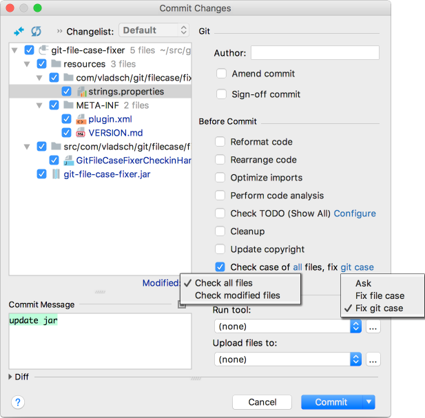

# Git File Case Fixer Plugin

**Git file case mismatch fixer plugin for JetBrains IDEs**

Download it from the IDE or https://plugins.jetbrains.com/plugin/10533-git-file-case-fixer

Detects and optionally fixes file case mismatch between git and the file system

Adds **Before Commit** check for file case mismatches between git and the file system
with corrective actions:

* Change git file case to match file system
* Change file system case to match git

Options:

* Select scope:
  * All files
  * only Modified files
* Select action to take on mismatch:
  * Ask: show prompt to decide what to do
  * Fix git case: change git to match file system case
  * Fix file case: change file system case to match git

## Screenshots

Before Commit Checking: 

If `fix:` action above is `Ask` and there are files with mismatched case in git:

  

Via Review button above or from `Version Control` tool window button
:

