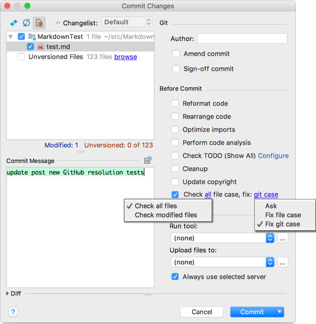

# Version History

[TOC]: # " "

- [1.0.20 (2023-04-22)](#1020-2023-04-22)
- [1.0.16](#1016)
- [1.0.14](#1014)
- [1.0.12](#1012)
- [1.0.10](#1010)
- [1.0.8](#108)
- [1.0.6](#106)
- [1.0.4](#104)
- [1.0.2](#102)
- [1.0.0](#100)
- [0.0.0](#000)

### 1.0.20 (2023-04-22)

* Change: since build to 203.*
* Fix: deprecated API usage, where possible without breaking compatibility with older IDEs.
* Fix: add options to `Version Control` > `Commit` before commit options.
* Fix: migrate to gradle build system.
* Fix: assertion for not starting git server from Dispatch thread.
* Fix: If an invalid vcs root exists and is in a subdirectory which was removed, would cause
  string index out of bounds.

### 1.0.16

* Fix: git requested as project instead of application service

### 1.0.14

* Add: `resources/search/searchableOptions.xml` for full text search across all
  configuration settings.

### 1.0.12

* Add: plugin icon

### 1.0.10

* Fix: catch virtual file exception and skip testing path

### 1.0.8

* Fix: 2016.3 compatibility

### 1.0.6

* Fix: handle parent directories' case mismatch in apply fixes. Previously fix git worked, but
  fix file system only worked for case mismatch in the file name.
* Fix: files with mismatched case could be doubled in the preview git file case fixer dialog.
* Fix: mark renamed files as vcs dirty so they get refreshed, otherwise they don't make it into
  the next commit.
* Fix: make default settings check unmodified files
* Fix: improve text and link layout of check-in handler.
* Fix: use LinkLabel for check-in handler options

### 1.0.4

* Fix: compatibility with 2016.3.8, some API uses were from later versions
* Fix: no mismatches balloon popup would show in first project instead of the current one.

### 1.0.2

* Fix: show mismatches action would not check files unless `check all files` was set in
  configuration
* Fix: message for modified and unmodified found files.
* Fix: vcs tool window icon

### 1.0.0

* Initial release

### 0.0.0

* first commit

